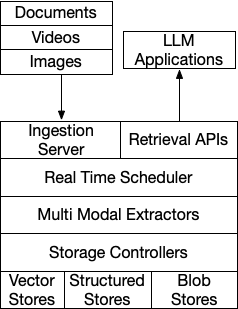
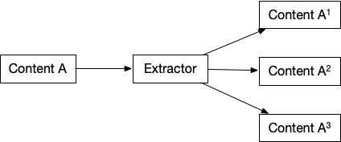

# Key Concepts

A typical workflow using Indexify involves uploading unstructured data(documents, videos, images, audio), wait for vector indexes or structured stores to be updated as extractors are applied on the content. As indexes are updated continously, you could retrieve updated information from them, via semantic search on vector indexes and SQL queries from structured data tables.



## Data Model

#### Content
Unstructured data ingested into Indexify or produced within the service by transforming ingested content. Ex - PDF, Videos, Images, Text. Content produced by transforming a source content has their lineage tracked to the source. For example a PDF document could be transformed by the system into Text, Images and JSON documents.

#### Extractor
A python class that can -
1. Transform unstructured data into intermediate forms. For example, a PDF document transformed into text, images, structured data if it contains tabular data.
2. Extract features like embedding or metadata(JSON) that goes into various indexes that can be retreived by LLM applications.

###### Transformation
Transformation is done by returning a list of Content objects from an extractor. Examples - Ingesting a Video content and returning the Audio from the video. Ingesting a PDF and returning chunks of text. Ingesting a Audio and segmenting it by voice activity detection such that it's chunked by pauses in speech. 

```
Extractor(Content) -> List[Content]
```



###### Metadata Extraction
An extractor can enrich  an ingested content by adding JSON metadata to the content. For example, adding bounding boxes of detected objects and their labels to an ingested image.

```
Extractor(Content) -> List[Feature(Type=Metadata)]
```


###### Embedding Extraction
An extractor can create embeddings from any ingested content. Indexify automatically creates Indexes from extracted embeddings. 
```
Extractor(Content) -> List[Feature(Type=Embedding)]
```


###### Transformation, Embedding and Metadata Extraction Combined
An extractor can transform, and extract embedding/metadata at the same time. Just return a list of new Content, along with the features of the transformed content, and a list of features at the same time. Indexify assumes that the features returned without any content belong to the ingested content and the list of new content are transformed content.
```
Extractor(Content) -> List[Feature... Content ...]
```

#### Extraction Policies
Applie a specific extractor on ingested content in a streaming fashion. They filter ingested or derived content and figures out which extractor to apply on them. Vector Indexes and Structured Stores are automatically updated with the extracted data. Think of policies as calls to extractors, they are long lived and are being called every time there is new content in the system.

Extraction Policies does the following -

1. Filters out ingested content whose mime-type doesn't match the mime-types supported by the extractor. For example a video can't be processed by a text embedding extractor so a policy for applying text embedding will filter out ingested videos.
2. Filters on additional metadata on the content with the metadata attached to the policy for additional filtering.
3. Invokes the extractor with the input parameters specified in the policy.


### Vector Index and Retreival APIs
Vector Indexes are automatically created from extractors that returns embeddings. You can use any of the supported vector databases(Qdrant, Elastic Search, Open Search, PostgreSQL and LanceDB). They can be lookedup using semantic/KNN search. 

### Structured Data Tables
Metadata extracted from content is exposed using SQL Queries. Content Sources become tables, and any metadata added to content for a given source can be queried either by using the ID of content or by predicates to a sql query.

Example - If you create a policy named `object_dector` which runs the Yolo object detector against all images ingested, you can query all the images which has a ball like this -

```
select * from object_detector where object_name='ball'
```

### Extraction Graphs
Extraction Policies can be chained together to transform content through a series of extractors or enrich content with additional metadata to hydrate structured datastores or vector stores.

The root of every graph is ingestion. Once data is ingested, one or many extraction policies pick them up based on the filters set on them. Any new content created by the extractors of the policy will have the source set to the extraction policy. Subsequent extraction policies can set content source as the extraction policy name.


#### Namespaces
Namespaces are logical abstractions for storing related content. Namespaces allow partitioning data based on security and organizational boundaries.